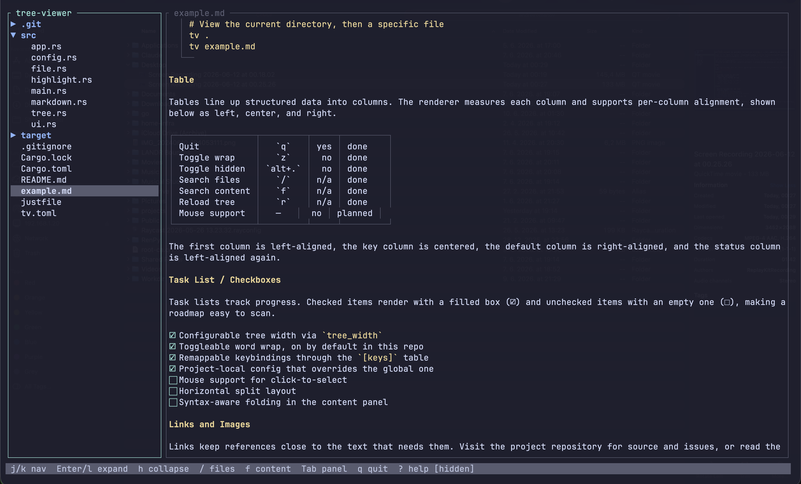

# mantis

**An instant terminal code browser.**

**Linux / macOS:**
```sh
curl -fsSL https://raw.githubusercontent.com/ansromanov/mantis/main/install.sh | sh
```

**Windows (PowerShell):**
```powershell
irm https://raw.githubusercontent.com/ansromanov/mantis/main/install.ps1 | iex
```

`mantis` is a fast, lightweight tree viewer for reading code in your terminal:
syntax highlighting, fuzzy search, and code folding in one small binary. No
config required, with an optional plugin system when you want more. Built with
[ratatui](https://ratatui.rs).

<p align="center">
  
</p>

```sh
mantis      # open the current directory and start browsing
```

That's it — no setup step. Press `F1` for help (or `?` while the tree is focused), `Ctrl+c` to quit.

## Why mantis?

`mantis` does one job: **move through a codebase and read it, fast**. It opens in
milliseconds, needs zero config, and stays out of your way. It is *not* an editor —
when you want to change something, press `Ctrl+e` to jump into your `$EDITOR`.

| | **mantis** | **Vim / Neovim** | **VS Code** | **Zed** | **Sublime Text** |
| --- | --- | --- | --- | --- | --- |
| Interface | Terminal (TUI) | Terminal (TUI) | GUI (Electron) | GUI (native/GPU) | GUI (native) |
| Footprint | Single ~MB binary | Light core | Hundreds of MB + RAM | Native app (tens of MB) | Native app (tens of MB) |
| Setup to be useful | **Zero** — just run `mantis` | Hours of config & plugins | Install + extensions + indexing | Minimal | Minimal |
| Starts in | Milliseconds | Fast (slower with a big config) | Seconds | Fast | Fast |
| Fuzzy + full-text search | Built in | Plugins (fzf/telescope) | Built in | Built in | Built in |
| Syntax highlighting | Built in | Built in | Built in | Built in | Built in |
| Price | Free / OSS | Free / OSS | Free | Free / OSS | Paid (free eval) |

mantis is the only row that's a read-only viewer — that's the whole pitch. Where the
editors edit, mantis just gets you in, around, and back out fast, in any terminal.

### What mantis is *not*

Be clear about the trade-offs before you install:

- **Not an editor.** No insert mode, no buffers, no saving — it reads, it doesn't
  write. Editing means handing the file to `$EDITOR`.
- **No LSP / IntelliSense.** No autocomplete, go-to-definition, diagnostics, or
  refactoring. It highlights syntax; it doesn't understand your code.
- **No integrated terminal, debugger, or task runner.** It's a viewer, not an IDE.
- **Batteries are opt-in.** Anything beyond the core (icons, extra languages, custom
  overlays) comes from plugins you enable yourself — less out-of-the-box than VS Code.
- **Terminal-bound.** A TUI in your terminal, not a GUI; icons need a Nerd Font.

If you want a fast, throwaway way to **explore a repo, read a file, or skim a
project** without launching a heavyweight editor, that's exactly the gap `mantis`
fills.

## Features

**Navigation**
- Tree navigation by keyboard or mouse, respecting `.gitignore`
- Breadcrumb path bar; change root, go up a directory, double-click to descend
- Code folding (`Space`) — collapse/expand blocks, with language-aware fold regions

**Search**
- Fuzzy file-name search (`Ctrl+P`) — fzf-style, as you type
- Full-text content search (`Ctrl+Shift+F`) across the tree
- In-file search (`Ctrl+F`) and go-to-line (`Ctrl+G`)

**Viewing & rendering**
- Syntax highlighting for a wide range of languages
- JSON pretty-printing for minified files
- Word wrap, line numbers, and a status bar (line, language, scroll, encoding)

**Productivity**
- Command palette (`Ctrl+Shift+P`) — fuzzy-find every action with its keybinding
- Recent files (`Ctrl+O`), copy path
- Open in your `$EDITOR` (`Ctrl+e`) and drop back into `mantis` when you're done
- Auto-reload on disk change; session persistence (expanded dirs, open file,
  scroll) restored on restart, cached outside the repo

**Customization**
- Live theme switching — built-in presets, fully recolorable
- Remappable keybindings and configurable layout via a simple TOML file
- Nerd Font file-type icons (optional), full mouse support
- Opt-in plugins — extra languages, icons, markdown rendering, and custom overlays

## Install

The one-liners above (no Rust toolchain required) download the prebuilt binary for
your platform, verify its checksum, and install it onto your `PATH`. On macOS or
Linux you can also use Homebrew:

```sh
brew tap ansromanov/mantis https://github.com/ansromanov/mantis
brew install mantis
```

From source:

```sh
git clone https://github.com/ansromanov/mantis.git
cd mantis && cargo build --release   # binary at target/release/mantis
```

See the [installation docs](https://ansromanov.github.io/mantis/installation.html)
for prebuilt binaries, Windows, and checksum verification.

## Usage

```sh
mantis              # view the current directory
mantis path/to/dir  # view a specific directory
mantis file.md      # open a file directly
```

Press `F1` for in-app help (or `?` while the tree is focused), and `Ctrl+c` to quit. For the full keybinding
list and every action name, see the
[Usage & Keybindings guide](https://ansromanov.github.io/mantis/usage.html) — or
press `Ctrl+Shift+P` in-app to fuzzy-find any action with its binding.

## Plugins

`mantis` works fully without plugins, but a plugin system is there when you want to
extend it. Two kinds:

- **Process plugins** — standalone executables that hook into app events and send
  actions back over newline-delimited JSON on stdin/stdout. They can add language
  providers (syntax highlighting + per-file-type fold regions), file-tree icons,
  custom overlays, and more. A plugin can be any executable — a compiled binary, a
  script, anything that reads stdin and writes stdout.
- **Syntax plugins** — `.sublime-syntax` files loaded into the highlighter at
  startup to add new file types without rebuilding `mantis`.

Press `p` for the plugin palette to enable/disable plugins; the choice persists
across restarts (under `[plugins]` in `mantis.toml`). Bundled plugins auto-register
and install on first enable, and a git-backed registry (`index.json`) lets `mantis`
discover and fetch community plugins.

See the [Plugins guide](https://ansromanov.github.io/mantis/plugins.html),
[Plugin Registry](https://ansromanov.github.io/mantis/plugin-registry.html), and
[Plugin Development](https://ansromanov.github.io/mantis/plugin-development.html)
docs for the full protocol and manifest (`plugin.toml`) format.

## Documentation

- [Usage & Keybindings](https://ansromanov.github.io/mantis/usage.html) — every key and action
- [Configuration](https://ansromanov.github.io/mantis/configuration.html) — `mantis.toml` options and `[keys]`
- [Themes](https://ansromanov.github.io/mantis/themes.html) — presets and every recolorable role
- [Plugins](https://ansromanov.github.io/mantis/plugins.html) — enable, install, and build plugins

See [`example.md`](example.md) for a document that exercises the `markdown` plugin's
renderer (enable it with `p` in-app, or `[plugins.markdown]` in `mantis.toml`).

## Development

```sh
just build     # debug build
just run .     # run against the current directory
just test      # run the test suite
just clippy    # lint
```

## Contributing

Contributions are welcome! See [CONTRIBUTING.md](CONTRIBUTING.md) for how to build,
test, and submit a pull request, plus the branch/commit conventions and what CI
checks. Project conventions in depth live in [AGENTS.md](AGENTS.md).

## License

[GPL-3.0-or-later](LICENSE) © Andrei Romanov
